# Cartão de Identidade Acadêmica

# Sobre o projeto

O Cartão de Identidade Acadêmica é um sistema desenvolvido em Django que tem como objetivo criar uma representação digital dos alunos em formato de cartão de perfil.

O projeto permite cadastrar, visualizar, editar e excluir alunos através de um CRUD completo desenvolvido em Django.

Os alunos possuem informações como:

- Nome
- Curso
- Biografia

Os dados são armazenados em banco SQLite e apresentados em uma interface web moderna no formato de cartões acadêmicos.

---

# Tecnologias utilizadas

- Python 3.13
- Django 6.1
- SQLite
- HTML5
- CSS3
- JavaScript

---

# Estrutura do projeto
CartaoAcademico
│
├── aluno
│ ├── models.py
│ ├── views.py
│ ├── urls.py
│ │
│ ├── templates
│ │ └── aluno
│ │ ├── base.html
│ │ ├── lista.html
│ │ ├── form_aluno.html
│ │ └── confirmar_exclusao.html
│ │
│ └── static
│ └── aluno
│ └── style.css
│
└── manage.py
---

# Modelo de dados

O sistema possui o modelo **Aluno**, contendo:

| Campo | Tipo | Descrição |
|---|---|---|
| nome | CharField | Nome completo do aluno |
| curso | CharField | Curso do aluno |
| bio | TextField | Descrição, interesses ou objetivos do aluno |

---

# Como executar o projeto

# 1. Clonar o repositório
git clone URL_DO_REPOSITORIO

Entrar na pasta do projeto:
cd CartaoAcademico

---

# 2. Criar ambiente virtual
python -m venv venv

---

# 3. Ativar o ambiente virtual

Windows PowerShell:
venv\Scripts\Activate.ps1

---

# 4. Instalar as dependências
pip install django

---

# 5. Executar as migrações
python manage.py makemigrations
python manage.py migrate

---

# 6. Criar usuário administrador
python manage.py createsuperuser

Informe:

- Nome de usuário
- Email
- Senha

Esse usuário permitirá acessar o painel administrativo do Django.

---

# 7. Executar o servidor
python manage.py runserver

O projeto estará disponível em:
http://127.0.0.1:8000/

---

# Endpoints disponíveis

# Página dos cartões acadêmicos

Exibe todos os alunos cadastrados:
http://127.0.0.1:8000/alunos/

---

# Painel administrativo

Área para cadastrar, editar e remover alunos:
http://127.0.0.1:8000/admin/

---

# Funcionalidades

- Cadastro de alunos pelo Django Admin
- Cadastro de alunos pela interface web
- Edição de alunos
- Exclusão segura com confirmação
- Armazenamento dos dados em banco SQLite
- Listagem dos alunos em cartões digitais
- Exibição de nome, curso e biografia
- Interface desenvolvida com HTML, CSS e JavaScript
- Tema escuro
- Alternância entre tema claro e escuro
- Animações e efeitos visuais nos cartões

---

# Interface

A página principal apresenta os alunos em formato de cartões acadêmicos, contendo:

- Nome do aluno
- Curso
- Biografia
- Design visual inspirado em uma ficha de identidade digital

---

# Banco de dados

O projeto utiliza SQLite como banco de dados padrão do Django.

O arquivo responsável pelo banco é:
db.sqlite3

---

# Desenvolvimento

Projeto desenvolvido para a disciplina de **Programação Backend utilizando Python e Django**.

Objetivo: construir um sistema backend para gerenciamento e apresentação de perfis acadêmicos digitais.

---

# Operações CRUD

O sistema implementa as quatro operações principais:

| Operação | Função |
|---|---|
| Create | Cadastro de novos alunos |
| Read | Visualização dos cartões acadêmicos |
| Update | Edição dos dados dos alunos |
| Delete | Exclusão de alunos com confirmação |

---

# Autor

Nome: Vitor Faria de Oliveira e Silva 

Curso: Sistemas de Informação

# Demonstração

# Página dos cartões acadêmicos

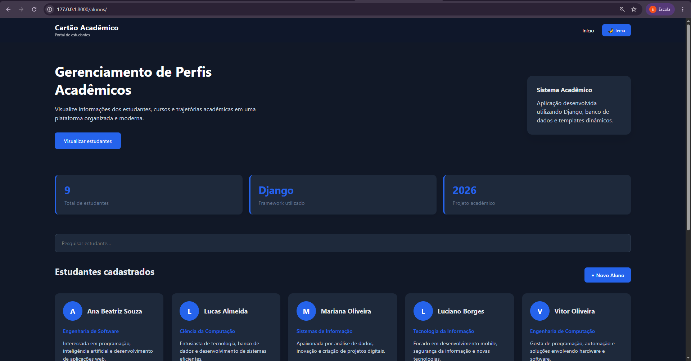

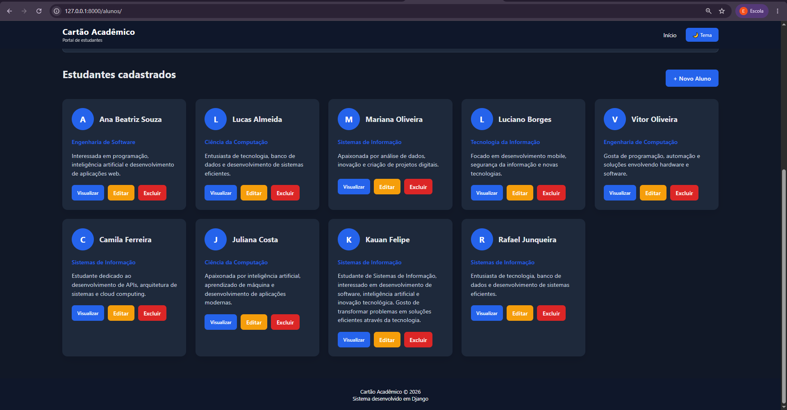

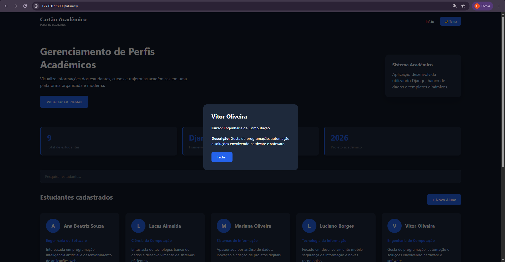

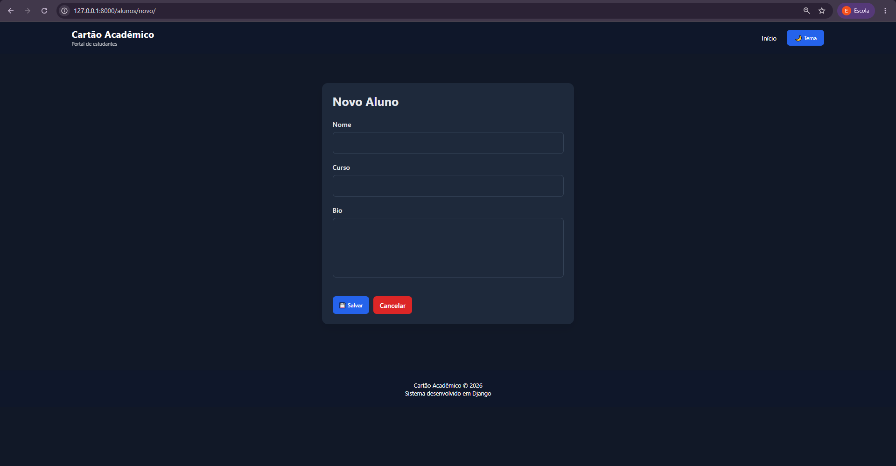

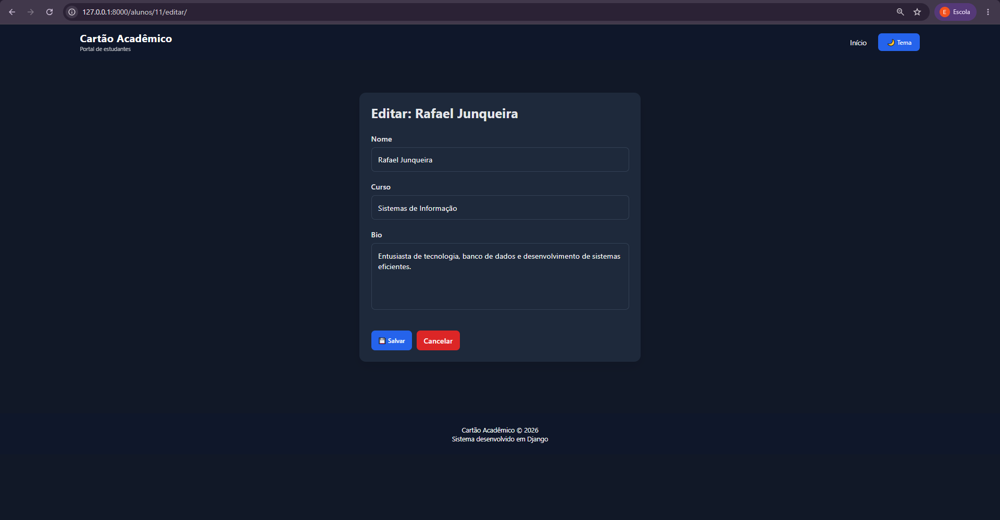

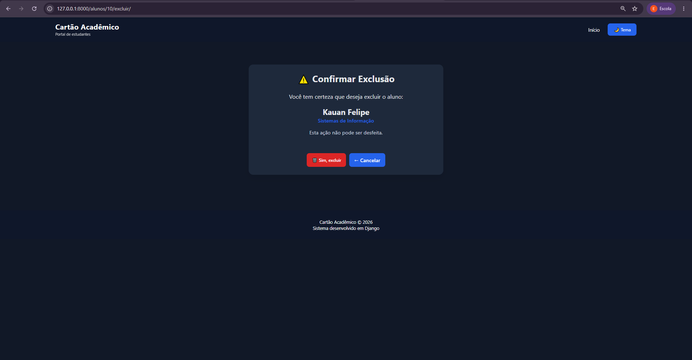

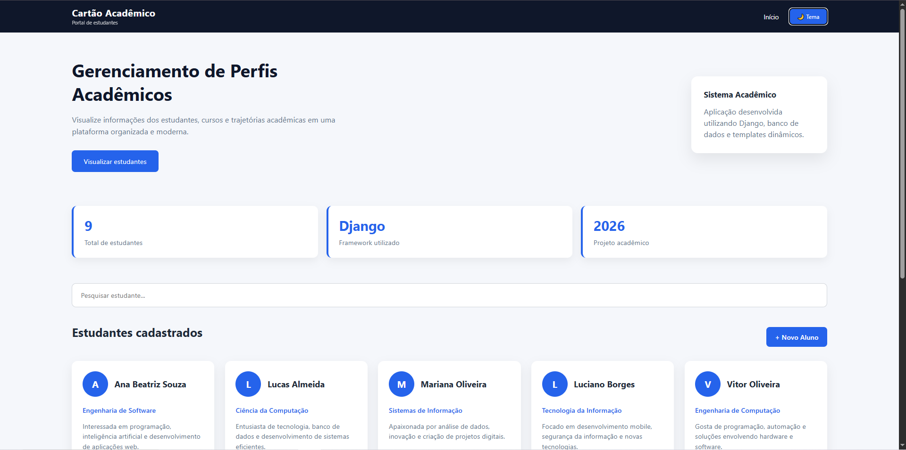

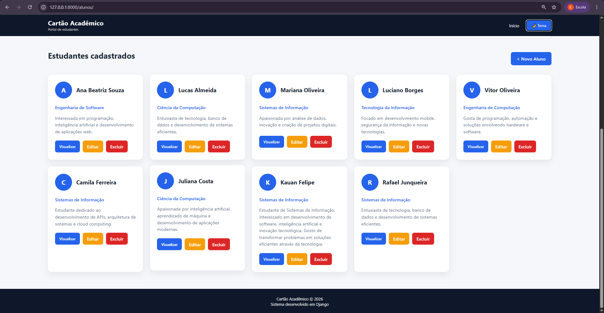

Acesse:
http://127.0.0.1:8000/alunos/

# Painel administrativo

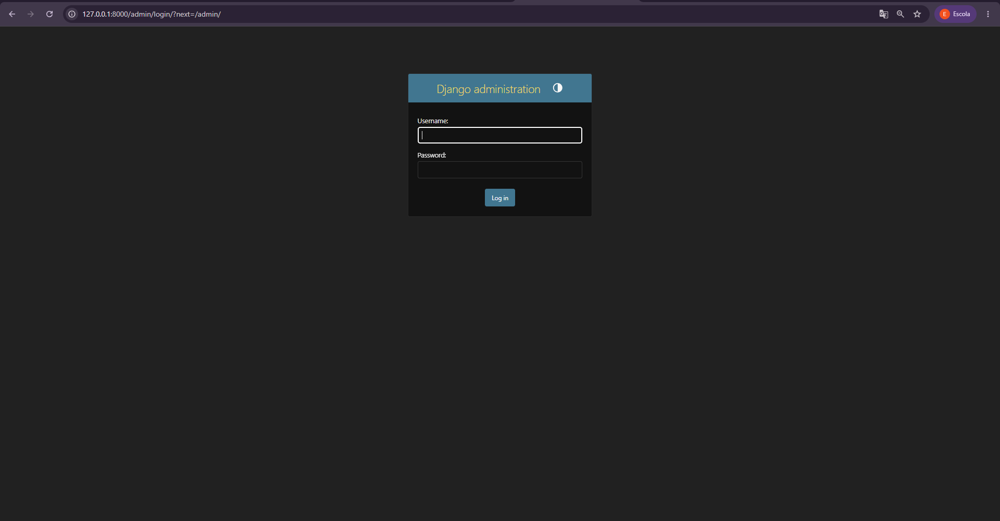

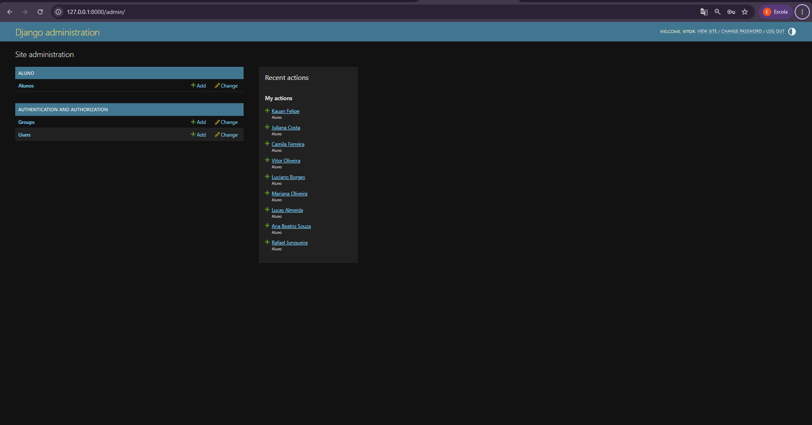

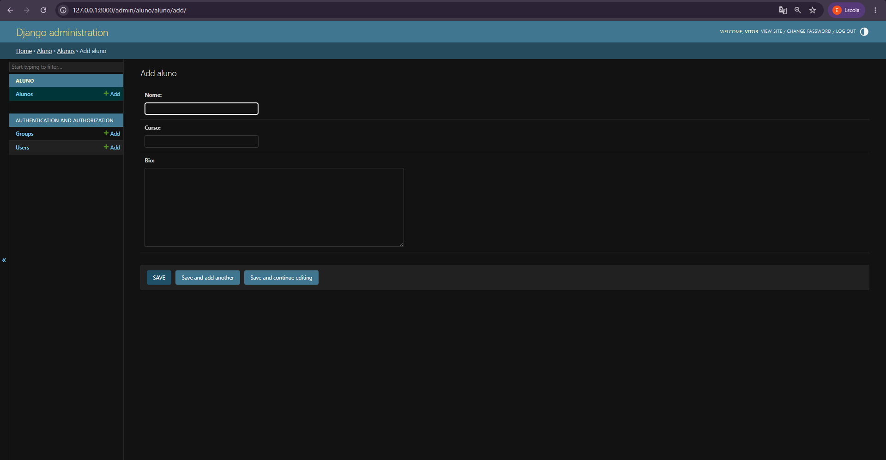

Acesse:
http://127.0.0.1:8000/admin/